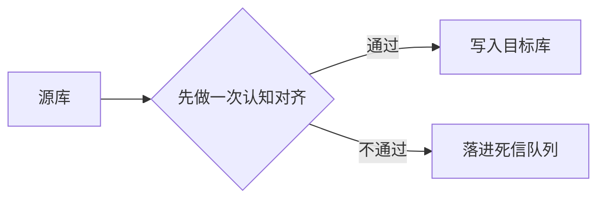

# 数据同步说明

这份文档讲每天凌晨那次同步是怎么跑的。

## 一、整体流程



图 1：同步的三个阶段。注意第二步要先跟源库 align 一下 schema，对不上就整批退回。

## 二、几个约定

同步任务每天凌晨两点起，跑完给值班的同学发一条消息[^1]。

出错的时候不要重跑整个任务，先看死信队列里落下了哪些行。

[^1]: 这里的「凌晨两点」按本机时区算；服务器换了 region 之后，这个点会跟着挪。

## 三、伪代码

```python
def sync(src, dst):
    # 先把两边的心智模型对齐，对不上就直接退出
    if not schema_ok(src, dst):
        raise SyncError("schema 对不上")   # 这一处要不要改，等定口径
    for row in src.read():
        dst.write(row)
```
